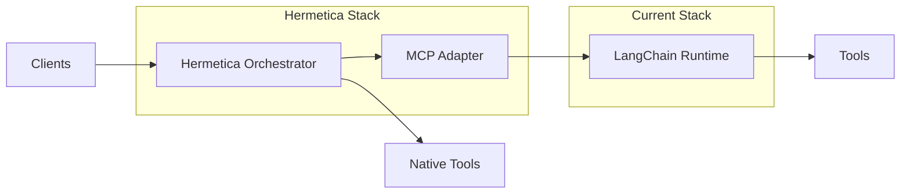

<p align="center">
  
</p>

> *“That which is hidden from the many will be revealed to the few.”*  
> *"Quod occultum est a multis, paucis revelabitur."*  
> — *Corpus Hermeticum*

# Hermetica

**Elixir/OTP-Powered Orchestration Layer for LLM Agents**

Hermetica is a **protocol-first, deterministic, and auditable agent orchestration system** designed for organizations that have outgrown the operational complexity of LangChain. 

It preserves your existing Python-based LangChain tools while replacing its brittle chain/agent runtime with a robust Elixir/OTP core.

---

## Why Hermetica?

Enterprises using LangChain often run into:

* **Unpredictable behavior** — Flows break due to implicit state, silent failures, or prompt drift.
* **Operational blind spots** — Limited observability for tracing, debugging, or replaying runs.
* **Vendor lock-in** — Tightly coupled orchestration and model provider code.
* **Compliance headaches** — Hard to guarantee auditability, masking, and RBAC.

Hermetica addresses these pain points by:

* Providing **typed, replayable flows** instead of ad-hoc callback chains.
* Adding **first-class observability** (OpenTelemetry, structured logs, replay tools).
* Offering a **migration path** off LangChain via a bridging adapter.
* Embedding **compliance and governance** into the orchestration layer.

---

## Architecture Overview

```text
Clients / Systems → Triggers (Webhook, Cron, Queue, MCP Event)
      │
Orchestrator (Elixir/OTP)
• FlowSupervisor (per-flow)
• FlowServer (per-run)
• Retries, Backoff, Circuit Breakers
      │
Flow DSL → Compiled DAG → Steps
      │
Tools via MCP or Native Adapters
      │
Postgres (State & Audit) + LiveView Dashboard
      │
Observability: OpenTelemetry, Metrics, Replay
```

---

## Migration Path from LangChain

Hermetica ships with a **LangChain Adapter** to let you:

1. **Wrap existing LangChain tools** as MCP servers with JSON Schema contracts.
2. **Run them inside Hermetica flows**, keeping your current Python code.
3. **Gradually replace** LangChain orchestration with Hermetica's typed DAG flows.
4. **Remove the adapter** once all flows are migrated.

This allows a **strangler pattern** migration with zero downtime.

---

## Example: LangChain Adapter Step

```elixir
step :enrich, mcp: {"langchain_adapter", "lookup_person"}, args: fn %{parse: p} ->
  %{email: p.email}
end
```

Where `langchain_adapter` is an MCP bridge that:

* Connects to a running LangChain process.
* Calls the corresponding Python tool.
* Validates inputs/outputs against JSON Schema.

---

## Features

* **Deterministic Flows** — Typed DAG, explicit error handling.
* **First-Class Observability** — OpenTelemetry traces, structured logs, replay.
* **Compliance Ready** — PII masking, RBAC, signed webhooks, audit exports.
* **MCP-first Tooling** — Model Context Protocol integration.
* **Flexible Connectors** — HTTP, Slack/Teams, DB, S3, Kafka.
* **Migration-Friendly** — LangChain adapter for gradual cutover.

---

## Roadmap

* **MVP (6 weeks)**

  * Runtime core (FlowServer, StepRunner, retries, Postgres schema).
  * MCP client and connectors.
  * LiveView dashboard.
  * LLM gateway for multiple providers.
  * Compliance features.
  * Dual-run harness for migration.

* **Future**

  * Visual DAG editor.
  * Built-in benchmarking suite.
  * Model-agnostic caching and routing.

---

## Setup

```bash
# Clone
 git clone git@github.com:your-org/hermetica.git
 cd hermetica

# Install deps
 mix deps.get

# Run tests
 mix test

# Start console
 iex -S mix

# Trigger a flow
 Hermetica.FlowServer.trigger(Hermetica.Flows.Hello, %{who: "world"})
```

---

## Database
Hermetica uses PostgreSQL via Ecto for persistence.

1. Create and migrate the database:
```bash
MIX_ENV=dev mix ecto.create -r Store.Repo
MIX_ENV=dev mix ecto.migrate -r Store.Repo
```
2. Verify your Postgres connection in apps/store/config/dev.exs (defaults to localhost, database hermetica_dev, user postgres).

##  Running Postgres with Docker

Hermetica persists runs/steps to Postgres. If you don’t have Postgres locally, you can spin it up with Docker.

### Option A: One-liner (Docker container)

```bash
docker run --name hermetica-pg \
  -e POSTGRES_USER=postgres \
  -e POSTGRES_PASSWORD=postgres \
  -e POSTGRES_DB=hermetica_dev \
  -p 5432:5432 -d postgres:16
```

Update your repo config if needed (defaults already match the above):

```elixir
# config/dev.exs (umbrella root)
import Config

config :store, ecto_repos: [Store.Repo]

config :store, Store.Repo,
  database: "hermetica_dev",
  username: "postgres",
  password: "postgres",
  hostname: "localhost",
  pool_size: 10
```
Then create/migrate:

```bash
mix ecto.create -r Store.Repo
mix ecto.migrate -r Store.Repo
```
To stop/remove the container later:
```bash
docker stop hermetica-pg && docker rm hermetica-pg
```

### Option B: docker-compose
Add a docker-compose.yml to your repo root:

```yaml
version: "3.9"
services:
  db:
    image: postgres:16
    container_name: hermetica-pg
    restart: unless-stopped
    environment:
      POSTGRES_USER: postgres
      POSTGRES_PASSWORD: postgres
      POSTGRES_DB: hermetica_dev
    ports:
      - "5432:5432"
    volumes:
      - hermetica_pg_data:/var/lib/postgresql/data
volumes:
  hermetica_pg_data:
```
Start it:
```bash
 docker compose up -d
```
Run DB tasks:
```bash
mix ecto.create -r Store.Repo
mix ecto.migrate -r Store.Repo
```
To stop:
```bash
docker compose down
```

## Verifying the DB
```bash
# list databases
docker exec -it hermetica-pg psql -U postgres -c '\l'

# check your tables
docker exec -it hermetica-pg psql -U postgres -d hermetica_dev \
  -c 'SELECT tablename FROM pg_tables WHERE schemaname = '\''public'\'';'
```

## Diagram: Strangler Pattern Migration



---

## Flow Execution & Retry Logic

Hermetica supports per-step **retries**, **timeouts**, and **error policies**.

When a step returns `{:error, reason}`, the runner will:
1. **Log** the failure with the step name and error.
2. **Retry** up to `retries:` times (per step).
3. **Back off exponentially** between retries: `200ms * 2^attempt` (capped at **2000ms**).
4. Optionally **compensate** using `on_error: {:compensate, &Module.fun/1}` to provide fallback output.

> **Requires DSL with `step/3`.** If your `Hermetica.DSL` doesn’t have it, add it (see snippet below).

---

### Example: Retry & Halt on Error

```elixir
defmodule Hermetica.Flows.RetryDemo do
  import Hermetica.DSL

  defflow "retry_demo" do
    step :sometimes_flaky, [retries: 3, timeout: 1_000, on_error: :halt], fn _ctx ->
      if :rand.uniform() < 0.7, do: {:error, :flaky}, else: {:ok, %{ok: true}}
    end
  end
end
```

### Example: Compensation (Fallback) on Error

```elixir
defmodule Hermetica.Flows.CompDemo do
  import Hermetica.DSL

  defflow "comp_demo" do
    step :write_to_cache,
      [retries: 2, timeout: 1_000, on_error: {:compensate, &__MODULE__.fallback/1}],
      fn _ctx ->
        {:error, :upstream_down}
      end
  end

  # Named compensator is safer than an inline anonymous fn in options
  def fallback(_ctx), do: {:ok, %{cached: false}}
end
```

#### Error policy quick ref

- on_error: :halt → stop the flow and return {:error, reason}

- on_error: :continue → skip this step’s output, continue

- on_error: {:compensate, &fun/1} → call fun.(ctx); if it returns {:ok, out}, record it as the step’s output

### Running a Flow
Start an interactive shell with Hermetica:
```bash
iex -S mix

```
Trigger a flow:
```elixir
# Synchronous result (includes final context)
Hermetica.FlowServer.trigger_sync(Hermetica.Flows.Hello, %{who: "world"})
```

Expected output:
```elixir
[info] flow hello triggered with %{who: "world"}
Hello from Hermetica
```

## Inspecting Results
Runs and steps are stored in Postgres:
```bash
psql -h localhost -U postgres -d hermetica_dev \
  -c "SELECT id, flow, status, inserted_at FROM runs ORDER BY inserted_at DESC LIMIT 5;"

psql -h localhost -U postgres -d hermetica_dev \
  -c "SELECT run_id, step, status FROM step_runs ORDER BY inserted_at DESC LIMIT 10;"
```
## Development Notes
- Flows live under apps/hermetica/lib/hermetica/flows/
- Each flow defines steps with retry/compensation metadata
- Persistence is handled by Store.Repo
- Logs are written with Logger

## Common issues 
- missing the :database key during ecto tasks
Make sure you’re running the real Ecto tasks from the umbrella root:

```bash
mix ecto.create -r Store.Repo
mix ecto.migrate -r Store.Repo
```
and that your repo config is in the umbrella root config/dev.exs (not only inside a child app).

- Connection refused
Ensure Postgres is running:
```bash
docker ps  # should show hermetica-pg
docker logs hermetica-pg --tail=50
```
- Auth errors
Ensure the username/password in config/dev.exs matches your container env vars (default postgres/postgres).

```go

If you want, I can also add a tiny **Makefile** (e.g., `make db-up`, `make db-down`, `make setup`) to make these commands even snappier.
::contentReference[oaicite:0]{index=0}
```

## License

MIT
